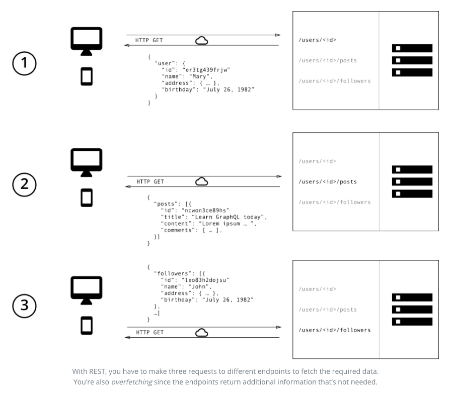
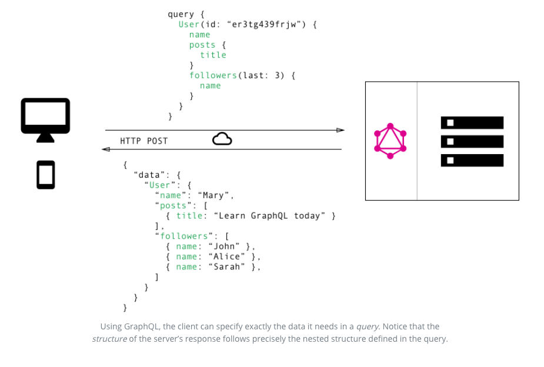

#### A new API standard: Why facebook created graphql?

> ###### *Note:*

- Basic understanding on RESTful API is required

- This post summaries [following link](https://www.howtographql.com/basics/1-graphql-is-the-better-rest/)

It's been a decade for using **RESTful API** to send data over HTTP with structured access resources in web application development industry. By using a 'stateless protocol', the **server** does not store any state of **client session** on server side. This allows to scale down thousands of concurrent users.  

However, REST api has shown its shortcomings to catch up huge requirements of the clients which is mainly "inefficiency of data fetching".

### Data Fetching Issue

Lets suppose the client wants the data of a **post** with the **writer's name** and its **followers**.

> **RESTful API**

The picture shows the Rest api retrieves every information of client's request with multiple endpoints. When client throws GET method with resources, the server returns followed datas.

> **GraphQL**

Since graph"QL" is Query Language, client throws specific query to server, clients receive matched datas from server. With this predefined query structure, graphql prevents over and underfetching.
